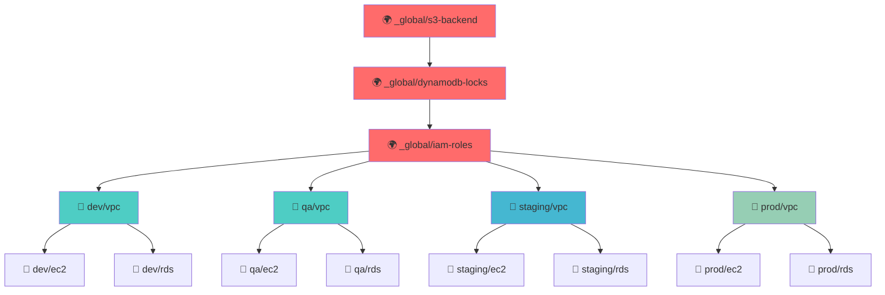

# Diagrama de Migración: Terraform → Terragrunt

## 📊 Estructura Actual vs Propuesta

### 🔴 ANTES: Estructura Terraform Actual

```
infra-tf/
├── provider.tf                    # ❌ Duplicación implícita
├── variables.tf                   # ❌ Variables globales limitadas
├── README.md
├── envs/
│   ├── dev/
│   │   ├── backend.tf            # ❌ Configuración duplicada
│   │   ├── main.tf               # ❌ Hardcoded values
│   │   └── terraform.tfvars      # ❌ Gestión manual
│   ├── qa/
│   │   ├── backend.tf            # ❌ Misma config repetida
│   │   ├── main.tf
│   │   ├── outputs.tf
│   │   ├── terraform.tfvars
│   │   └── variables.tf
│   ├── staging/
│   │   ├── backend.tf            # ❌ Otra vez repetida
│   │   ├── main.tf
│   │   ├── outputs.tf
│   │   ├── terraform.tfvars
│   │   └── variables.tf
│   └── prod/
│       ├── backend.tf            # ❌ Y otra vez...
│       ├── main.tf
│       ├── outputs.tf
│       ├── terraform.tfvars
│       └── variables.tf
├── global/
│   ├── main.tf                   # ⚠️ Sin gestión de dependencias
│   ├── s3/...
│   ├── dynamodb/...
│   └── iam/...
├── modules/                      # ✅ Esto se mantiene
│   ├── vpc/
│   ├── ec2/
│   └── rds/
└── scripts/
    ├── apply.sh                  # ❌ Scripts custom complejos
    ├── destroy.sh
    └── init.sh
```

### 🟢 DESPUÉS: Estructura Terragrunt Propuesta

```
infra-tf/
├── terragrunt.hcl                # ✅ Config raíz centralizada
├── README.md
├── docs/
│   └── terragrunt-migration-diagram.md
├── _common/                      # ✅ Configuraciones compartidas
│   ├── common.hcl               # Variables comunes
│   ├── backend.hcl              # Backend centralizado
│   └── provider.hcl             # Provider configuration
├── envs/
│   ├── _global/                 # ✅ Recursos globales mejorados
│   │   ├── terragrunt.hcl      # Config global
│   │   ├── s3-backend/
│   │   │   └── terragrunt.hcl  # ✅ Gestión declarativa
│   │   ├── dynamodb-locks/
│   │   │   └── terragrunt.hcl  # ✅ Con dependencias
│   │   └── iam-roles/
│   │       └── terragrunt.hcl  # ✅ Orden de creación
│   │
│   ├── dev/                     # ✅ Ambiente dev mejorado
│   │   ├── terragrunt.hcl      # Config específica dev
│   │   ├── account.hcl         # Account/region config
│   │   └── vpc/
│   │       └── terragrunt.hcl  # ✅ Solo config específica
│   │
│   ├── qa/                      # ✅ Herencia automática
│   │   ├── terragrunt.hcl      
│   │   ├── account.hcl         
│   │   ├── vpc/
│   │   │   └── terragrunt.hcl  
│   │   └── rds/
│   │       └── terragrunt.hcl  # ✅ Dependencias explícitas
│   │
│   ├── staging/                 # ✅ Configuración DRY
│   │   ├── terragrunt.hcl      
│   │   ├── account.hcl         
│   │   ├── vpc/
│   │   │   └── terragrunt.hcl  
│   │   ├── ec2/
│   │   │   └── terragrunt.hcl  
│   │   └── rds/
│   │       └── terragrunt.hcl  
│   │
│   └── prod/                    # ✅ Máxima reutilización
│       ├── terragrunt.hcl      
│       ├── account.hcl         
│       ├── vpc/
│       │   └── terragrunt.hcl  
│       ├── ec2/
│       │   └── terragrunt.hcl  
│       └── rds/
│           └── terragrunt.hcl  
│
└── modules/                     # ✅ Se mantienen igual
    ├── vpc/
    │   ├── main.tf
    │   ├── variables.tf
    │   └── outputs.tf
    ├── ec2/
    └── rds/
```

## 🔄 Flujo de Dependencias con Terragrunt



## 📁 Ejemplo de Configuración Terragrunt

### 🎯 Archivo Raíz: `terragrunt.hcl`

```hcl
# Configuración base para todo el proyecto
locals {
  # Cargar configuración común
  common_vars = read_terragrunt_config(find_in_parent_folders("_common/common.hcl"))
  
  # Variables del proyecto
  project_name = "plub"
  aws_region   = "us-east-1"
}

# Backend remoto centralizado
remote_state {
  backend = "s3"
  generate = {
    path      = "backend.tf"
    if_exists = "overwrite_terragrunt"
  }
  config = {
    bucket         = "plub-use1-terraform-state"
    key            = "${path_relative_to_include()}/terraform.tfstate"
    region         = local.aws_region
    dynamodb_table = "plub-use1-terraform-lock"
    encrypt        = true
    
    skip_bucket_versioning         = false
    skip_bucket_ssencryption      = false
    skip_bucket_root_access       = false
    skip_bucket_enforced_tls      = false
  }
}

# Generar provider automáticamente
generate "provider" {
  path = "provider.tf"
  if_exists = "overwrite_terragrunt"
  contents = <<EOF
terraform {
  required_version = ">= 1.4.0"
  required_providers {
    aws = {
      source  = "hashicorp/aws"
      version = "~> 5.0"
    }
  }
}

provider "aws" {
  region = var.aws_region
  
  default_tags {
    tags = {
      Project     = "${local.project_name}"
      ManagedBy   = "terraform"
      Environment = var.environment
    }
  }
}
EOF
}

# Variables comunes a todos los ambientes
inputs = {
  aws_region = local.aws_region
}
```

### 🔧 Ambiente Específico: `envs/dev/terragrunt.hcl`

```hcl
# Configuración específica para ambiente DEV
include "root" {
  path = find_in_parent_folders()
}

locals {
  environment = "dev"
}

inputs = {
  environment = local.environment
  
  # Tags específicas del ambiente
  common_tags = {
    Environment = local.environment
    CostCenter  = "development"
  }
}
```

### 🌐 VPC con Dependencias: `envs/dev/vpc/terragrunt.hcl`

```hcl
# Configuración VPC para DEV con dependencias
include "root" {
  path = find_in_parent_folders()
}

include "env" {
  path = find_in_parent_folders("terragrunt.hcl")
}

terraform {
  source = "../../../modules/vpc"
}

inputs = {
  vpc_config = {
    cidr_block           = "10.10.0.0/16"
    name                 = "plub-use1-dev-vpc"
    public_subnets_cidr  = ["10.10.1.0/24", "10.10.2.0/24"]
    private_subnets_cidr = ["10.10.101.0/24", "10.10.102.0/24"]
    azs                  = ["us-east-1a", "us-east-1b"]
  }
}
```

### 🗃️ RDS con Dependencia de VPC: `envs/dev/rds/terragrunt.hcl`

```hcl
include "root" {
  path = find_in_parent_folders()
}

include "env" {
  path = find_in_parent_folders("terragrunt.hcl")
}

# ✅ Dependencia explícita de VPC
dependency "vpc" {
  config_path = "../vpc"
  
  mock_outputs = {
    vpc_id             = "vpc-fake-id"
    private_subnet_ids = ["subnet-fake-1", "subnet-fake-2"]
  }
  
  mock_outputs_allowed_terraform_commands = ["validate", "plan"]
}

terraform {
  source = "../../../modules/rds"
}

inputs = {
  # ✅ Usar outputs de VPC automáticamente
  vpc_id     = dependency.vpc.outputs.vpc_id
  subnet_ids = dependency.vpc.outputs.private_subnet_ids
  
  # Configuración específica RDS
  db_config = {
    identifier     = "plub-dev-db"
    engine         = "postgres"
    engine_version = "15.4"
    instance_class = "db.t3.micro"
    allocated_storage = 20
  }
}
```

## ⚡ Comandos Simplificados

### 🔴 ANTES (Scripts Custom):
```bash
# Inicializar ambiente
./scripts/init.sh development

# Aplicar cambios  
./scripts/apply.sh staging

# Destruir recursos
./scripts/destroy.sh production
```

### 🟢 DESPUÉS (Terragrunt Nativo):
```bash
# Inicializar un ambiente específico
terragrunt init --terragrunt-working-dir envs/dev/vpc

# Plan de un componente
terragrunt plan --terragrunt-working-dir envs/dev/vpc

# Apply con dependencias automáticas
terragrunt run-all apply --terragrunt-working-dir envs/dev

# Apply todo el proyecto respetando dependencias
terragrunt run-all apply

# Destroy con orden inverso automático  
terragrunt run-all destroy --terragrunt-working-dir envs/dev

# Plan de todo respetando dependencias
terragrunt run-all plan --terragrunt-working-dir envs/
```

## 📈 Beneficios de la Migración

| Característica | Antes | Después | Mejora |
|---------------|-------|---------|---------|
| **Duplicación de Config** | 4x backend.tf idénticos | 1x configuración central | 🟢 -75% código |
| **Gestión Variables** | Manual en cada ambiente | Herencia automática | 🟢 DRY principle |
| **Dependencias** | Manuales/Scripts | Declarativas/Automáticas | 🟢 Reliability++ |
| **Comandos** | Scripts bash custom | Nativos terragrunt | 🟢 Standardización |
| **Mantenimiento** | Alto (4 lugares) | Bajo (1 lugar) | 🟢 -80% esfuerzo |
| **Escalabilidad** | Lineal con ambientes | Constante | 🟢 Future-proof |

## 🎯 Plan de Migración Recomendado

### Fase 1: Preparación (1-2 días)
1. ✅ Crear estructura `_common/`
2. ✅ Configurar `terragrunt.hcl` raíz  
3. ✅ Backup del estado actual

### Fase 2: Migración DEV (2-3 días)  
1. ✅ Migrar `envs/dev/` a terragrunt
2. ✅ Validar funcionalidad completa
3. ✅ Documentar proceso

### Fase 3: Resto de Ambientes (3-4 días)
1. ✅ Aplicar patrón a qa/staging/prod
2. ✅ Verificar dependencias
3. ✅ Cleanup archivos antiguos

### Fase 4: Optimización (1-2 días)
1. ✅ Agregar validaciones adicionales
2. ✅ Documentación completa  
3. ✅ Training del equipo

---

**Total estimado: 7-11 días de trabajo**

¿Te ayudo a empezar con alguna fase específica? 🚀